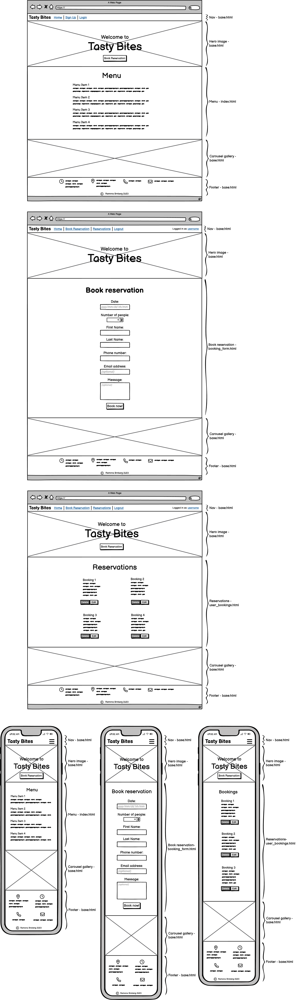
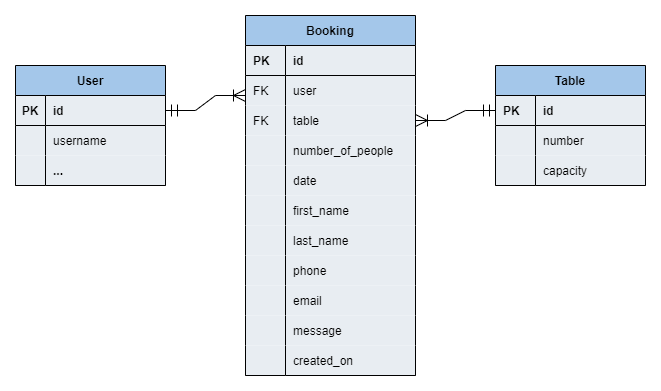

# Tasty Bites

Tasty Bites is a newly opened restaurant in New York, USA. In just a few months, it has already managed to attract many food enthusiasts with its unique dishes and cozy atmosphere and has therefore created this website to spread the word.

Tasty Bites is for the people who like to sit down and enjoy delicious food and create great memories. You need to be there to really understand the feeling of it all. On the website, users can make reservations and if something unexpected happens, it is easy to edit their reservation or cancel it completely. To make a reservation, the user needs to log in and if they don't already have an account, it is possible to quickly and easily register an account!

The webiste also displays the restaurant's menu and contact information to make it easy for the user to get in touch if they have any questions.

### [You can see the website live here](https://tasty-bites-rb-427304cf20b7.herokuapp.com/)

# UX

This website targets two different groups:

1. The customers that enjoys food and wants a good experience with unique atmosphere, also the possibility to book, edit and delete their reservations.
2. The restaurant staff that can recieve bookings from their customers and they can then assign specific tables to the different bookings to get a better structure in the restaurant.

# User Stories

### [Link to my project with user stories](https://github.com/users/ramonabroberg/projects/6)

The goal with this website is to give food enthusiasts the possibility to easy make reservations on the go or from home. They just have to log in which will take them to the page where they can book reservations.

The users also have the ability to edit and delete their resrevations while they are logged in. It should be easy to navigate through the website and it also shows the restaurant's menu to give the customer even more use of the website.

- As a Site Admin I can create, read, update and delete bookings so that I can manage the restaurant's bookings.
- As a Site User I can book a reservation so that I know it's booked in advance.
- As a Site User I can edit my reservation so that the restaurant gets updated with the new information.
- As a Site User I can cancel my reservation so that the restaurant sees that the reservation has been cancelled.
- As a Site User I can see my booked reservations so that I see the details about them if I forget.
- As a Site User I can register an account so that I can book reservations.
- As a Site User I can login and logout so that I can book reservations and log out of my account afterwards.
- As a Site User I can view the menu on the page so that I can see what options that are available.
- As a Site User I can see the restaurant's contact information so that I know how to get in touch with them.

# Features

## General layout

Some elements will be on all sites. This includes the navigation, the hero image, the carousel gallery and the footer.

### Navigation

- The navigation is fixed at the top of the page and shows the restaurant's name "Tasty Bites" to the left with the menu options next to it.
- The menu options while logged out is: Home, Sign Up and Login.
- It has a good contrast in colors and are easy to read.

- When the user have logged in they see their name to the right as "Logged in as".
- The menu options as logged in is: Home, Book Reservation, Reservations and Logout.

- On mobile devices the menu options collapses and will only show as a menu icon. When you click on it, it will display the menu options.

### Hero image

- The hero image is of restaurant with warm welcoming colors to make the user feel invited.
- It has a title over the image that says "Welcome to Tasty Bites".
- It has a button with the text "Book Reservation" that takes you to the booking form page as long as you're logged in, if you're not you will first be directed to the login page.

### Carousel Gallery

- Under the menu it is a carousel with images that switches automatically.
- The images goes in the same tone and feeling as the rest of the website.

### Footer

- The footer shows the restaurant's contact information with icons that goes with it so the users know how to get in touch.

## Home

The first page on the webiste is Home, this page display the restaurant's menu so it will show between the hero image and the carousel gallery.

### Restaurant Menu

- The user will see the restaurant's menu neatly listed and categorized by kind of food and it shows prices for each dish.

## Book Reservation *(logged in)*

The second page while logged in is where the user can book reservations.

- The form will list errors if the user try to enter wrong kind of information so it's easy to correct it.
- The reservations get saved on the server right away.

## Reservations *(logged in)*

The third page while logged in is where the user can see the booked reservations. The reservations are only available to see while logged in.

- The user can see all the details about each booking.
- They all have one Delete button and one Edit button each ehich makes it possible for the user to update the information or delete the reservation completely.

## Sign Up

- When you enter the website you can click on "Sign Up" if you want to register an account.
- It has a link to the login page if the user already has an account.
- The user have to choose a username and a password that has to be filled in twice, email is optional.
- The form has instructions that the user has to follow to be able to create an account.

## Login

- The login page looks similar to the sign up page. The difference is that the user only has to enter it's username and password to log in on the page.
- It has a link to the Sign Up page.
- The user will land on the booking form page automatically when logged in.

## Logout *(logged in)*

- When the user is logged in and clicks on "Logout" up on the navigation bar the user will land on this page first.
- The user gets the question if they're sure they want to log out.
- To log out they click on the button "Yes, please!"

# Testing

### General

- The website is tested and works in several web browsers and devices.
- It works on different screen sizes and is responsive.
- The navigation stays at the top.
- The Book Reservation button on the hero image works correctly and redirects to the login page if the user isn't logged in. It then continues to the booking form page as planned.
- The carousel gallery is displaying the images nicely and fades as it should.
- The user gets success alert messages when they log in and log out.
- All alerts dissapear after three seconds as planned.

### Book Reservations

- The form fields recieve the information as they should.
- If the user choose a date from the past it throws an error that describes that it has to be a date in the future.
- If the user choose less than 1 as number of people it throws an error that says that it has to be at least 1.
- The first name and last name fields only accept up to 50 characters.
- The phone field throws an error if the user enter other than numbers.
- The email field only accepts an email address so it has to be in the correct format.
- The email field is optional, it works to submit the form with the field empty.
- The message field is optional, it works to submit the form with the field empty.
- If there is several errors at the same time they get displayed as a list.
- When the form is correctly submitted the user redirects to the Reservations page and will see a green alert that says that the reservation was booked successfully.

### Reservations

- The booked reservations shows as planned.
- They gets deleted when the user clicks on the Delete button.
- When they click on an Edit button they see the booked reservation as a form with the information filled in as it was previously saved.
- The user can click on Cancel to get back to the bookings.
- The user can make changes and then click on Update, it will then get back to the bookings but also see a green alert message that the reservation was updated successfully.
- The form works the same as the booking_form above when it comes to throwing errors when the user give wrong kind of information.
- The new changes are showing correctly on the page.
- Both changes and deletions also happens in admin mode.

# Wireframe

# Diagram

